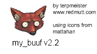

# Buuf Moon

**Buuf Moon** is a non-commercial complete theme for Pale Moon, rebuilding the classic Buuf visual style on a Pale Moon-compatible theme structure.

This is a beta release. The theme is usable, but some secondary windows and edge cases may still need visual polish.

## Current release

**Version:** 1.0.0beta1  
**Target application:** Pale Moon  
**Tested with:** Pale Moon 34.3.0 on Linux GTK3 and Windows

## What is included

- Buuf-styled browser toolbar icons
- Buuf-styled Add-ons Manager categories
- Buuf-styled Preferences icons
- Buuf-styled Permissions icons
- unified khaki/green Buuf color palette
- recolored menu bar, navigation bar, tab bar, tabs and manager windows
- custom scrollbars using the theme palette
- Linux and Windows-specific fixes where needed

## Credits

Buuf icons and artwork by **Paul Davey**, also known as **Mattahan**.

Buuf Remastered icon theme by **niivu**, based on Mattahan's original Buuf artwork.

Additional Buuf-derived Linux icon assets from **Buuf For Many Desktops / Buuf Nestort**.

Original **My Buuf** Firefox theme by **terpmeister**.

**Camimoon** by **Lootyhoof** is used as a Pale Moon technical template and partial source for missing icons.

Buuf Moon adaptation for Pale Moon by **Halvar666**.

## License summary

Buuf Moon is a mixed-license, non-commercial theme.

Buuf icons and derivative artwork are licensed under **Creative Commons Attribution-NonCommercial-ShareAlike 2.5**.

Theme code, CSS structure and Pale Moon adaptation files derived from Camimoon or Mozilla theme code retain their original **Mozilla Public License** terms.

See [`LICENSE.md`](LICENSE.md) and [`NOTICE.md`](NOTICE.md) for details.

## Installation

1. Download the `.xpi` file from the GitHub Releases page.
2. Open Pale Moon.
3. Drag the `.xpi` into the browser window, or install it through the Add-ons Manager.
4. Restart Pale Moon if requested.
5. Select **Buuf Moon** in the theme list.

## Status

This is a beta intended for testing and visual refinement before the stable 1.0 release. Bug reports are welcome through GitHub Issues.
